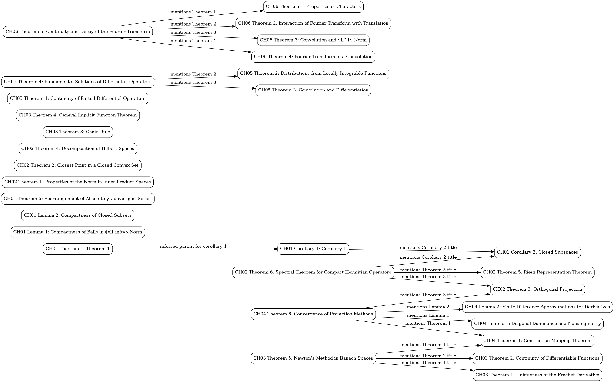
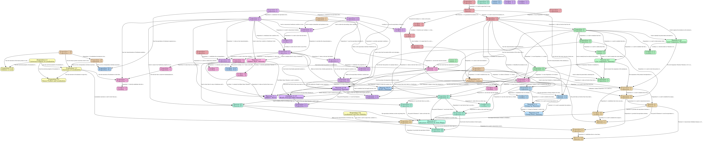

# 🧠 my_brain_agent

> *An LLM-powered personal knowledge base agent — ingest PDFs, compile structured wikis, trace theorem dependencies, all via prompts.*

---

## Inspiration

<table>
<tr>
<td width="100" valign="top">

<br><strong>Karpathy</strong>
</td>
<td>
<blockquote class="twitter-tweet"><p lang="en" dir="ltr">LLM Knowledge Bases<br><br>Something I&#39;m finding very useful recently: using LLMs to build personal knowledge bases for various topics of research interest. In this way, a large fraction of my recent token throughput is going less into manipulating code, and more into manipulating knowledge (stored as markdown and images).</p>&mdash; Andrej Karpathy (@karpathy) <a href="https://x.com/karpathy/status/2039805659525644595">April 2, 2026</a></blockquote>
</td>
</tr>
</table>

**TLDR from the thread:** Raw data from sources is collected, then compiled by an LLM into a `.md` wiki, then operated on by various CLIs by the LLM to do Q&A and to incrementally enhance the wiki, and all of it viewable in Obsidian. You rarely ever write or edit the wiki manually — it's the domain of the LLM.

---

## 📚 Example: Functional Analysis Knowledge Base

This repo contains a working example built from the graduate textbook *Analysis for Applied Mathematics* (Ward Cheney, GTM 208). The agent ingests the full PDF, detects chapter boundaries, and produces per-chapter wiki articles with theorems, proofs, examples, and exercises — all cross-linked.

### 🔗 Theorem Dependency Graph

The agent automatically builds a theorem dependency graph showing how results connect across chapters:



The graph tracks 30 theorems, lemmas, and corollaries across 6 chapters — from normed linear spaces through Hilbert spaces, calculus in Banach spaces, distributions, and Fourier transforms — with edges showing which results depend on or reference others.

### 📖 The Topic

**Functional Analysis** is the study of infinite-dimensional vector spaces and the operators acting on them. It underpins modern PDE theory, quantum mechanics, numerical methods, and approximation theory. The textbook covers:

| Chapter | Topic |
|---------|-------|
| 1 | Normed Linear Spaces — norms, compactness, Riesz's Lemma |
| 2 | Hilbert Spaces — inner products, projections, Riesz Representation, Spectral Theorem |
| 3 | Calculus in Banach Spaces — Fréchet derivatives, chain rule, implicit functions, Newton's method |
| 4 | Basic Approximation — contraction mappings, projection methods |
| 5 | Distributions — generalized functions, convolution, fundamental solutions |
| 6 | Fourier Transform — characters, convolution theorems, decay properties |

### 🎯 How It's Prompted

The ingestion pipeline uses a two-stage prompting strategy:

**Stage 1 — Chunk summarization:** Each ~3-page chunk of a chapter is processed with a structured prompt that demands:
- Exact definitions & notation
- Full theorem statements (hypotheses + conclusions)
- Proof sketches (only if present in the text)
- Worked examples & notable exercises
- Key insights (3–8 bullets)

**Stage 2 — Hierarchical merge:** Chunk summaries are merged with a synthesis prompt that deduplicates, cross-references, and produces a cohesive article with sections for Overview, Definitions, Theorems, Proof Ideas, Examples, Exercises, Key Insights, and `[[Wikilinks]]` for Obsidian graph navigation.

Both prompts enforce strict grounding: the LLM may only use evidence from the source text, never invent theorem names or external facts.

### 💬 Example Q&A

> **Prompt:** "Which theorems in Chapter 3 (Banach space calculus) rely on results from Chapter 1 (normed linear spaces)? Trace the dependency chain."

**Answer:**

The theorem graph shows cross-chapter links, and the deeper chain back to Chapter 1 is structural:

```
Ch 1: Banach Space (definition)          ← foundational
  │   completeness of normed spaces
  │   Cauchy sequences converge
  │
  ├──► Ch 3, Theorem 2: Continuity of Differentiable Functions
  │       Proof uses: triangle inequality (Ch 1 norm axiom)
  │
  ├──► Ch 3, Theorem 4: Implicit Function Theorem
  │       Requires: Y is a *complete* normed space (= Banach space, Ch 1)
  │       Proof uses: Contraction Mapping Theorem (Ch 4 Thm 1)
  │         └── which itself requires completeness (Ch 1)
  │
  └──► Ch 3, Theorem 5: Newton's Method in Banach Spaces
          Requires: X, Y are Banach spaces (Ch 1 completeness)
          Proof: sequence {x_n} shown to be Cauchy → converges by completeness
          Uses: Contraction Mapping Theorem (Ch 4 Thm 1 ← Ch 1 completeness)
```

| Ch 3 Result | Ch 1 Dependency | How |
|---|---|---|
| **Thm 1** (Uniqueness of Fréchet derivative) | Norm axioms, linearity | Uses linearity of bounded operators on normed spaces |
| **Thm 2** (Differentiable ⟹ continuous) | Triangle inequality | Proof applies $\|f(x+h) - f(x)\| \leq \|Ah\| + o(\|h\|)$ |
| **Thm 4** (Implicit Function Theorem) | Banach space completeness | Hypothesis requires $Y$ complete; proof invokes contraction mapping |
| **Thm 5** (Newton's Method) | Banach space completeness | Convergence proof shows iterates form a Cauchy sequence in a complete space |

**Key insight:** Chapter 3's entire framework is built on **completeness** — the defining property that elevates a normed linear space (Ch 1) to a Banach space. Without it, neither the Implicit Function Theorem nor Newton's Method would have convergence guarantees.

---

## 📚 Example: Commutative Algebra (LLM-Enhanced Graph)

A second knowledge base built from *Introduction to Commutative Algebra* (Atiyah & Macdonald). Here the theorem graph is built using **GPT-4o to identify conceptual dependencies** — not just textual citations — producing a much richer connectivity map (148 edges vs ~30 from regex alone).

### 🔗 LLM-Enhanced Theorem Dependency Graph



80 theorems across 11 chapters, with edges identified by asking GPT-4o: *"Which earlier results does this theorem directly depend on?"*

**Most depended-on results:**
| Deps | Result | Role |
|------|--------|------|
| 9 | Proposition 6.2 | Chain conditions (ACC/DCC characterizations) |
| 8 | Proposition 4.1 | Primary decomposition existence |
| 7 | Proposition 1.8 | Prime ideal containment |
| 6 | Proposition 6.5 | Noetherian module characterization |
| 6 | Theorem 7.13 | Noetherian normalization |

### 💬 Example Q&A

> **Prompt:** "How is it that a Dedekind domain can be described so many different ways?"

**Answer:**

A Dedekind domain sits at the intersection of several independent algebraic properties that happen to be equivalent in dimension 1. The knowledge base reveals at least **6 equivalent characterizations** from Chapters 9 and 5:

| # | Characterization | Source |
|---|-----------------|--------|
| 1 | Noetherian + integrally closed + every nonzero prime is maximal | Defn (Ch 9) |
| 2 | Every nonzero fractional ideal is invertible | Theorem 9.8 |
| 3 | Every nonzero ideal factors uniquely into prime ideals | Corollary 9.4 |
| 4 | Noetherian domain of dim 1 where every primary ideal is a prime power | Theorem 9.3 |
| 5 | Noetherian domain of dim 1 where every localization at a nonzero prime is a DVR | Theorem 9.3 |
| 6 | Integrally closed Noetherian domain where every localization $A_\mathfrak{p}$ is a PID | via Prop 9.2 + Prop 9.7 |

**Why so many descriptions?** Each characterization approaches from a different structural angle:
- **(1)** is algebraic-geometric: "nice" singularities (integrally closed) + low dimension
- **(2)** is module-theoretic: ideal invertibility = the ideal group is well-behaved
- **(3)** is arithmetic: unique factorization, but for ideals instead of elements
- **(4–5)** are local-to-global: Dedekind = "locally a DVR everywhere"
- **(6)** is the strongest local statement: locally a PID

The deep reason is that in dimension 1, the Noetherian + integrally closed combination is extremely rigid — it forces all these properties simultaneously. The theorem graph shows this: Theorem 9.8 depends on Theorem 9.3, which depends on Proposition 9.2 (the DVR characterization), which in turn uses Nakayama's Lemma (2.6) and primary decomposition (Ch 4).

---

## ⚙️ What This Repo Does

This project implements that pattern:

1. **Ingest** — PDFs and papers go into `raw/` directories
2. **Compile** — LLM agents (via GitHub Models API / Hugging Face) process them into structured markdown wiki articles
3. **View** — The generated wiki is browsable in Obsidian (or on GitHub)
4. **Enhance** — Tools for building theorem graphs, fixing formatting, and cross-linking content

## 🗂 Project Structure

```
my_brain_agent/
├── functional_analysis/        ← Knowledge base: Functional Analysis (GTM 208)
│   ├── raw/                    ← Source PDFs
│   ├── wiki/                   ← LLM-generated markdown articles
│   │   ├── chapters/           ← Per-chapter deep summaries
│   │   └── graphs/             ← Theorem dependency graphs (.dot, .mmd, .png)
│   ├── ingest_chapters.py      ← PDF → chapter-level wiki articles
│   ├── ingest_knowledge_base.py← PDF → full-book wiki summary
│   ├── build_theorem_graph.py  ← Generate theorem dependency graphs
│   └── fix_math_delimiters.py  ← Post-process LaTeX formatting
├── test_knowledge_base/        ← Additional knowledge base articles
├── sync_papers.py              ← Sync & summarize new papers from raw/
├── do_sync.py                  ← Paper sync via Hugging Face Inference
├── copilot_agent_test.py       ← GitHub Models API testing
├── load_env.sh                 ← Load environment variables
├── requirements.txt            ← Python dependencies
└── .env.example                ← Template for required secrets
```

## 🚀 Setup

```bash
# Create virtual environment
python3 -m venv my_brain
source my_brain/bin/activate
pip install -r requirements.txt

# Configure secrets (copy and fill in your tokens)
cp .env.example .env
# Edit .env with your HF_TOKEN and GITHUB_TOKEN

# Load environment variables
source load_env.sh
```

## 🔑 Required Tokens

| Variable | Source |
|----------|--------|
| `HF_TOKEN` | [Hugging Face Settings → Tokens](https://huggingface.co/settings/tokens) |
| `GITHUB_TOKEN` | [GitHub → Developer Settings → Fine-grained PAT](https://github.com/settings/tokens) (needs `models:read` scope) |

## 💻 Usage

```bash
source load_env.sh

# Ingest a PDF book into chapter-level wiki articles
cd functional_analysis
python ingest_chapters.py

# Build theorem dependency graph
python build_theorem_graph.py

# Sync and summarize new papers
cd ..
python sync_papers.py
```

## 📄 License

[MIT License](LICENSE) — do whatever you want with it.
